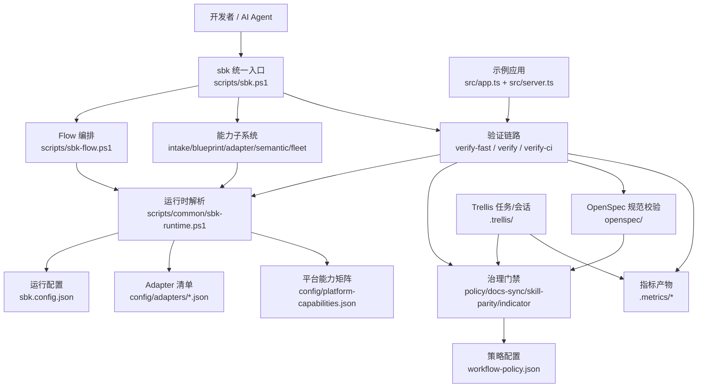
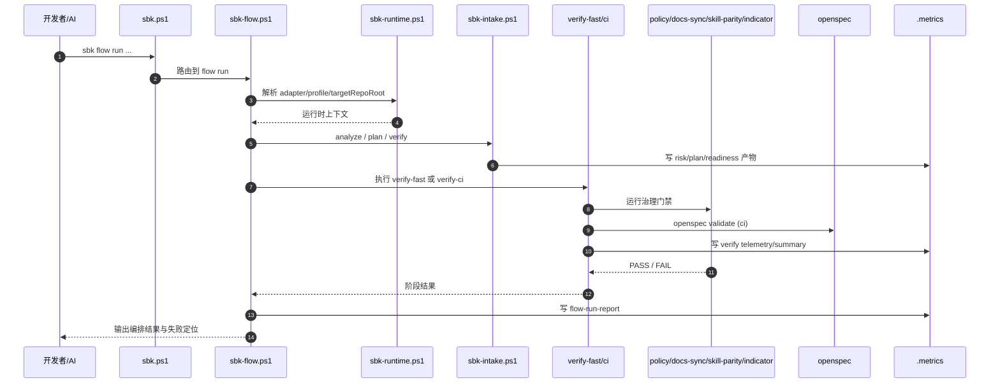
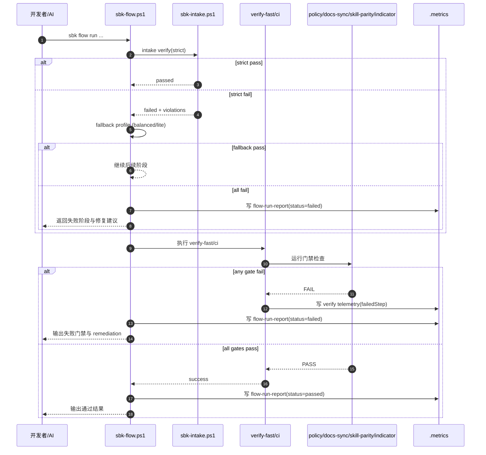
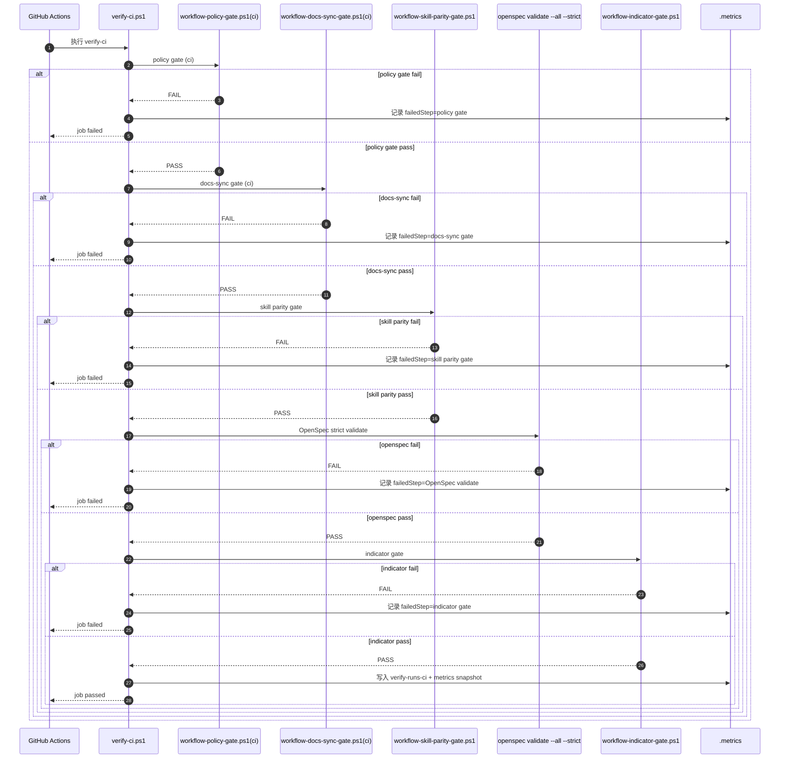

# 代码库架构深潜（Workflow Kernel + App Demo）

本篇给你一份“能直接拿来定位问题”的架构图，不讲抽象概念，直接对应仓库里的真实文件。

## 0. 架构总览图（Mermaid）



读图说明：

- 从左到右看：`sbk.ps1` 是统一入口，所有能力最终进入同一套运行时解析与门禁链路。
- 从上到下看：运行配置（`sbk.config.json`、adapter、platform）决定执行边界，门禁与指标决定是否放行。
- 重点记忆：`openspec/` 管“变更意图与证据”，`.metrics/` 管“执行结果与健康状态”。

## 0.1 关键调用时序图（Mermaid）



读图说明：

- 这是“正常主路径”：`flow run` 会按参数条件串联 runtime、intake、verify、gate、metrics。
- 核心闭环是“执行 -> 产物”：每个关键阶段都会在 `.metrics/` 留下可审计结果。
- 你排查问题时优先看两处：`failed stage`（控制面）与对应 `metrics artifact`（证据面）。

## 0.2 失败分支时序图（Mermaid）



读图说明：

- 失败分两层：先看 `intake verify(strict)`，再看 verify 阶段门禁（policy/docs-sync/skill-parity/indicator）。
- strict 失败时会尝试 profile fallback；全部失败才会终止并写入 failed 报告。
- 门禁失败会同时写 `failedStep` 与 flow 报告，便于把“失败现象”映射到“具体规则”。

## 0.3 CI 专用失败回路图（Mermaid）



读图说明：

- CI 是严格串行门禁：前一关失败，后续步骤不再执行（fail-fast）。
- 故障定位顺序按图即可：policy -> docs-sync -> skill-parity -> openspec -> indicator。
- 每个失败分支都会落到 `.metrics`，所以复盘优先对照 `failedStep` 与对应 gate 报告文件。

## 1. 一句话架构

这个仓库由两部分组成：

- 工作流内核（主角）：`sbk` 命令族 + policy/indicator/docs-sync/skill-parity 门禁 + OpenSpec/Trellis 协同。
- 示例应用（配角）：`src/` 下的内存任务 API，用于证明“代码层 + 流程层”可以同时被验证。

你可以把它理解成：

- `scripts/` 负责“怎么做事”（执行引擎）。
- `workflow-policy.json` + `sbk.config.json` 负责“按什么规则做事”（策略与运行时配置）。
- `openspec/` 负责“为什么做这件事、做到了什么”（需求与任务证据）。
- `.metrics/` 负责“做得怎么样”（可观测性和质量信号）。

## 2. 控制面入口：`sbk` 命令分发器

统一入口在：

- `scripts/sbk.ps1`

核心作用：

- 解析一级命令（`flow` / `blueprint` / `intake` / `adapter` / `semantic` / `fleet` / `verify:*`）。
- 把调用路由到对应脚本，不在入口重复业务逻辑。

常用调用方式：

```powershell
npm run sbk -- flow run --target-repo-root .
npm run sbk -- intake analyze --target-repo-root .
npm run sbk -- semantic reference-map --file src/app.ts --line 33 --column 12
```

## 3. 运行时解析层：`sbk-runtime`（配置驱动）

核心文件：

- `scripts/common/sbk-runtime.ps1`
- `sbk.config.json`
- `config/adapters/*.json`
- `config/platform-capabilities.json`

它负责解决 4 个问题：

1. 当前目标仓库是谁（`targetRepoRoot`）。
2. 当前 adapter 是谁（`node-ts`/`python`/`go`/`java`/`rust`）。
3. 当前 profile 是谁（`strict`/`balanced`/`lite`）。
4. 当前 verify 命令矩阵与实现路径边界是什么。

这意味着仓库不是把规则硬编码在脚本里，而是“脚本读配置后执行”。

## 4. 编排主链路：`sbk flow run`

核心文件：

- `scripts/sbk-flow.ps1`

这是“从 0 到可执行”的主工作流，典型阶段如下：

1. 可选安装（`--with-install`）。
2. greenfield bootstrap（绿地场景）。
3. blueprint apply + verify。
4. intake analyze / plan / verify。
5. adapter doctor。
6. verify fast（可通过 `--skip-verify` 跳过）。
7. 可选 fleet collect/report/doctor。
8. 输出 `flow-run-report.json` + `flow-run-report.md`。

边界说明：

- `flow run` 不会隐式触发 `explore/new-change/record-session`。
- 目标仓非 git 时，flow 可能先执行 `git init` 再进入 intake。

你可以把它看作一个有状态机特征的 orchestrator：每个阶段都有开始/失败/通过记录，失败可定位到具体 stage。

## 5. 治理门禁层：Fail-Closed 的执行约束

关键配置：

- `workflow-policy.json`

关键实现：

- `scripts/workflow-policy-gate.ps1`
- `scripts/workflow-docs-sync-gate.ps1`
- `scripts/workflow-skill-parity-gate.ps1`
- `scripts/workflow-indicator-gate.ps1`

门禁分工：

- `policy gate`：变更治理、分支命名、active change 完整性、任务证据表、会话证据、敏感路径与密钥扫描、orchestrator 边界。
- `docs sync gate`：脚本/配置触发文件发生变化时，要求对应文档一起更新。
- `skill parity gate`：`.codex/.agents/.claude` 三套能力镜像一致性。
- `indicator gate`：基于指标阈值进行过程健康判定（失败率、P90 lead time、rework、drift、token cost）。

## 6. 验证流水线：`verify:fast` / `verify` / `verify:ci`

核心文件：

- `scripts/verify-fast.ps1`
- `scripts/verify.ps1`
- `scripts/verify-ci.ps1`
- `scripts/common/verify-telemetry.ps1`

执行特征：

- 都是“分步执行 + 分步计时 + 分步结果”。
- 都会写 verify run telemetry 到 `.metrics/*.jsonl`。
- `verify-ci` 额外会跑 OpenSpec strict validate、collect-metrics、indicator gate。

CI 入口：

- `.github/workflows/ci.yml` 调用 `./scripts/verify-ci.ps1`。

## 7. Intake：准入评估与分级治理

核心文件：

- `scripts/sbk-intake.ps1`

输出三类产物：

- `intake-risk-profile.json`：风险画像。
- `intake-hardening-plan.json`：分阶段硬化计划。
- `intake-readiness.json`：profile 准入结果。

strict profile 下，policy 可要求 readiness 产物必须存在并通过。

## 8. 蓝图与安装：把内核发到目标仓库

核心文件：

- `scripts/sbk-install.ps1`
- `scripts/sbk-blueprint.ps1`
- `config/blueprints/registry.json`
- `config/release/channels/*.json`

职责划分：

- install/upgrade：复制内核资产、注入 package scripts、做 channel 兼容性检查。
- blueprint：根据 pack 清单渲染模板、校验 required artifacts、写 `.sbk/blueprint.lock.json`。

## 9. 语义工具链：跨语言确定性重构入口

统一入口：

- `scripts/sbk-semantic.ps1`

后端实现：

- TypeScript：`scripts/semantic-rename.ts`（language service）。
- Python：`scripts/semantic-python.py`（token index）。
- Go/Java/Rust：`scripts/semantic-index.py`（symbol index）。

支持操作：

- `rename`
- `reference-map`
- `safe-delete-candidates`

每次执行都会落审计结果到 `.metrics/semantic-operation-report.json`。

## 10. Trellis / OpenSpec：流程元系统

目录：

- `.trellis/`：开发流程工具、任务上下文、会话记录。
- `openspec/`：规范、变更、设计、任务与证据。

理解重点：

- Trellis 解决“日常执行与会话管理”。
- OpenSpec 解决“变更意图、设计依据、可审计证据”。
- 两者通过 verify/policy gate 被绑定在一起，避免“只改代码不改规格”。

## 11. 数据面示例：`src/` 任务 API

文件：

- `src/app.ts`
- `src/server.ts`

能力：

- 健康检查：`GET /health`
- 任务列表：`GET /api/tasks`
- 创建任务：`POST /api/tasks`
- 更新任务：`PATCH /api/tasks/:id`

这部分不是内核本体，但用于 e2e 与最小可运行验证。

## 12. 建议阅读顺序（按角色）

开发者（首次接手）：

1. `docs/practice/01-一页上手-从引入到首轮可运行.md`
2. `docs/practice/04-能力手册-命令分层与组合策略.md`
3. 本文

治理维护者（门禁/流程 owner）：

1. 本文第 5/6/7/10 节
2. `docs/practice/07-运维与治理-质量门禁与指标.md`
3. `workflow-policy.json`

平台扩展者（多语言/多项目接入）：

1. 本文第 3/8/9 节
2. `docs/06-多项目类型接入与配置指南.md`
3. `config/adapters/*.json` + `scripts/sbk-adapter.ps1`

## 13. 三条实操建议

- 先跑 `sbk flow run`，再拆分到子命令，学习曲线最低。
- 任何“脚本/配置”改动，都要同步检查 docs-sync 与 skill-parity。
- 做语义改名优先 `sbk semantic`，不要直接文本替换。

## 14. 常见误读纠偏

### 14.1 针对架构总览图（0 节）

- 误读：`sbk.ps1` 里实现了全部业务逻辑。  
  纠偏：`sbk.ps1` 主要做路由，核心逻辑分布在 `sbk-flow`、`sbk-intake`、`sbk-install` 等脚本。
- 误读：`openspec/` 与 `.metrics/` 作用重复。  
  纠偏：`openspec/` 是“意图与规范证据”，`.metrics/` 是“执行结果与运行指标”，两者互补。
- 误读：示例应用 `src/` 是内核主功能。  
  纠偏：`src/` 主要是演示与测试载体，内核主能力在 `scripts/` 与策略配置。

### 14.2 针对关键调用时序图（0.1 节）

- 误读：`flow run` 一定会执行完全相同的步骤。  
  纠偏：会受参数与上下文影响（如 `--skip-verify`、场景判定、profile fallback）。
- 误读：只要终端显示成功就足够。  
  纠偏：应同时检查 `.metrics/flow-run-report.*` 与 verify telemetry，确保有可追溯证据。
- 误读：intake 只在初次接入有意义。  
  纠偏：存量仓库接管、风险升高或策略调整后，仍应重新执行 intake analyze/plan/verify。

### 14.3 针对失败分支时序图（0.2 节）

- 误读：strict 失败代表流程完全不可用。  
  纠偏：`flow` 可能自动尝试 `balanced/lite`，应先看 fallback 结果再决定下一步。
- 误读：任何失败都应直接重跑整条流水线。  
  纠偏：先根据 `failedStep` 精准修复（例如 task evidence、docs sync、skill parity）再重跑。
- 误读：只看最后失败提示就能定位根因。  
  纠偏：需结合 gate 报告与 flow 报告的阶段信息，避免把症状当根因。

### 14.4 针对 CI 专用失败回路图（0.3 节）

- 误读：CI 失败顺序与本地一定完全一致。  
  纠偏：CI 使用 `-Mode ci`，并依赖 `WORKFLOW_BASE_REF` 等上下文，行为可能与本地有差异。
- 误读：后面的门禁没报错就表示没问题。  
  纠偏：CI 是 fail-fast，前一关失败时后续不会执行，不能据此判断后续健康。
- 误读：修复一次失败后无需看历史指标。  
  纠偏：仍应检查 `.metrics` 的历史趋势（失败率、rework、drift），防止反复回归。

## 15. 30 秒排障路径（失败类型 -> 直达命令）

使用方式：先识别失败类型，再执行对应 1-2 条命令，避免盲目全量重跑。

### 15.1 Policy Gate 失败

```powershell
npm run workflow:policy
Get-Content .metrics/workflow-policy-gate.md
```

### 15.2 Docs Sync Gate 失败

```powershell
npm run workflow:docs-sync
Get-Content .metrics/workflow-docs-sync-gate.md
```

### 15.3 Skill Parity Gate 失败

```powershell
npm run workflow:skill-parity
Get-Content .metrics/workflow-skill-parity-gate.md
```

### 15.4 Indicator Gate 失败

```powershell
npm run metrics:collect
npm run workflow:gate
```

### 15.5 CI 失败但本地不复现

```powershell
npm run verify:ci
Get-Content .metrics/verify-runs-ci.jsonl | Select-Object -Last 5
```

### 15.6 OpenSpec 校验失败

```powershell
openspec validate --all --strict --no-interactive
Get-Content .metrics/workflow-policy-gate.md
```
